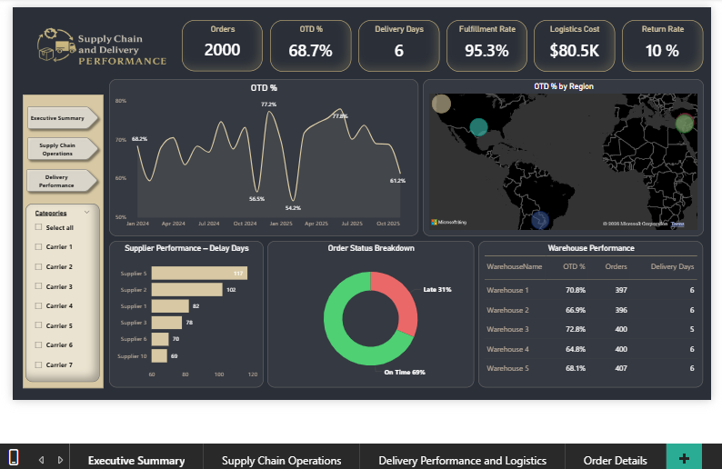

# Power BI – Supply Chain & Delivery Performance Dashboard

## Overview
This project showcases a Power BI dashboard built using AI-generated
synthetic data to simulate real-world supply chain operations.

## Data
The dataset used in this project is **synthetic data generated using AI tools**.
The actual datasets and Power BI (.pbix) file are kept private.

## Tools Used
- Power BI
- Excel
- AI-generated Synthetic Data

## Key KPIs
- On-Time Delivery %
- Average Delivery Days
- Pick-Pack Time
- Return Rate

## Dashboard Preview

### Executive Summary

### Supply Chain Operations

### Delivery Performance Analysis

### Order Details

> Note: Full project files can be shared upon request.
